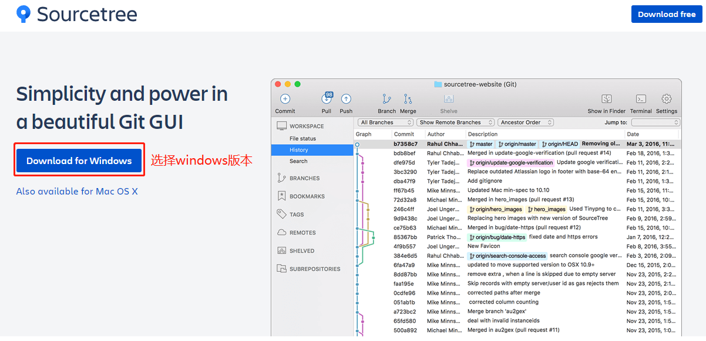
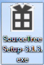

windows环境souretree客户端下载安装
----------------------------------

### 下载

首先，官网下载SourceTree，谷歌搜索SourceTree，第一就是下载网址。 附上网站链接： > https://www.sourcetreeapp.com/

官网下载，点击Download for Windows，我是Windows10所以我需要下Windows版本的，Mac也有相应的版本工具。

 下载后的安装包：目前版本为3.1.3

 双击安装文件，程序是自动安装的，不需要你一步步的点击的

安装到这个界面，需要你提供授权，勾选我同意，点击下一步：

这里需要你提供bitbucket或者Atlassian账户，当然我们可以用谷歌账户去登陆，我这次就是用谷歌账户去登陆的，当然，一般人走到这一步就没法继续了，因为这需要访问VPN外网。百度也会有很多跳过账户注册的教程，这里就不详述了。感兴趣的小伙伴可自行百度学习。

点击Atlassian账户

点击log in with Google

输入谷歌账户点击下一步：

输入密码后自动跳转到注册完成界面，点击下一步即可。

下一步要安装Git和Mercurial工具，点击下一步即可。

程序会自动下载工具安装

等待几分钟后工具安装完成。点击下一步。

   弹出一个提示框，提示安装全局忽略文件，点击“是”就好。

   点击是会弹出新的提示框：    

   可以点击“是”，也可以点击否。这需要你提供一个git密钥。这里你必须得先有个密钥。我暂时没有，先点“否”。程序自动打开到主界面。到这里，你的安装已经全部完成了。

 Git安装

官网下载链接：https://git-scm.com/downloads

左边是稳定版本，右边是最新版本，建议下载稳定版本。点击自动下载。完成后双击打开程序进行安装。

安装开始：

点击Next：

设置安装路径，可自行设置。我就默认路径安装了。点击Next：

勾选桌面图标（可选），点击Next：

创建开始菜单文件夹，直接点击Next下一步就好：

选择Git的编辑器，默认Vim可自行选择其他工具，我这边就使用默认工具，点击Next：

配置Git环境变量选择默认第二个就好，点击Next：

选择HTTPS传输后端，选择默认第一个，点击Next：

配置结束行转换，点击Next：

配置终端仿真器与Git BASH一起使用，点击Next即可：

其他配置选项，点击Next：

配置实验选项，点击Install，直接安装即可。

等待安装完成。

> Launch Git Bash：启动Git命令行工具。 View Release Notes：查看发行通知。 取消所有勾选，点Finish，完成Git工具的安装。

SourceTree使用教程

安装完成Git后，创建SSH密钥：ssh-keygen -t rsa -C “youreamil如1234@qq.com”。

打开SourceTree点击工具，配置密钥。

点击创建或启动SSH密钥：

点击load加载创建好的私钥。

选择所有文件类型，选择id_rsa(私钥），不要选择下面的id_rsa.pub（公钥）会报错。确认打开

点击确定，点击save private key：

点击保存配置。命名保存该密钥配置。配置完成。

打开工具，选项

选择刚刚配置好的SSH密钥（命名保存的密钥）：

克隆打开项目，选择文件，克隆/新建：

输入git的克隆地址：

点击克隆，等待克隆完成。

至此，你已经学会如何安装克隆git项目。
